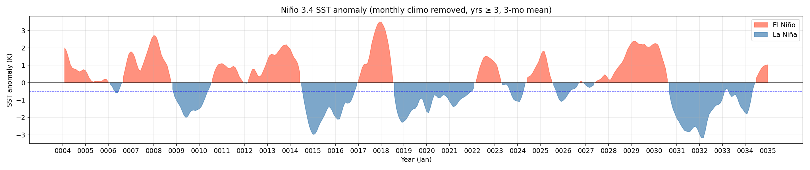
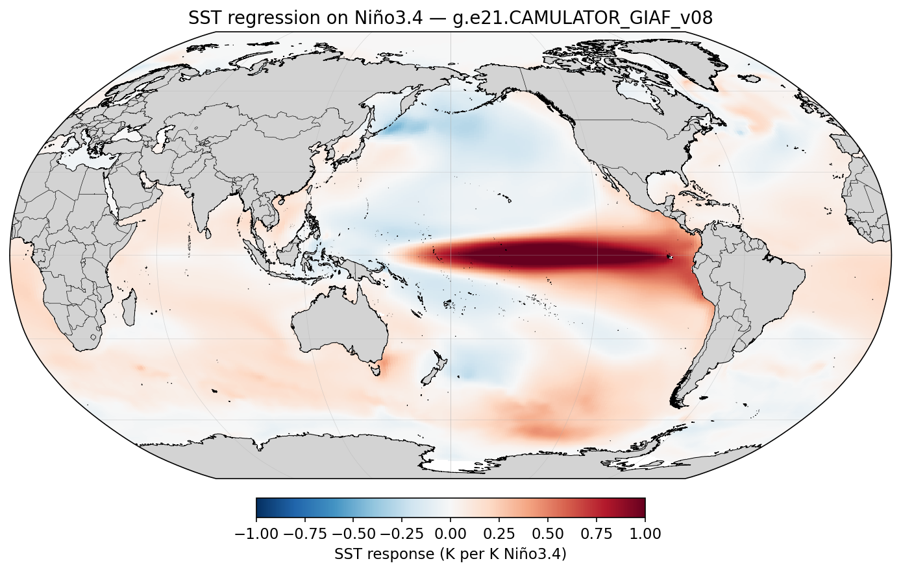
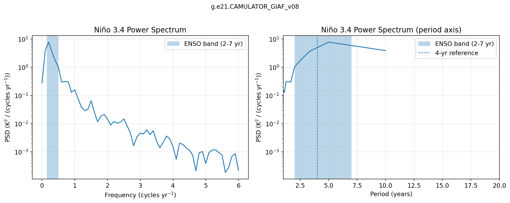
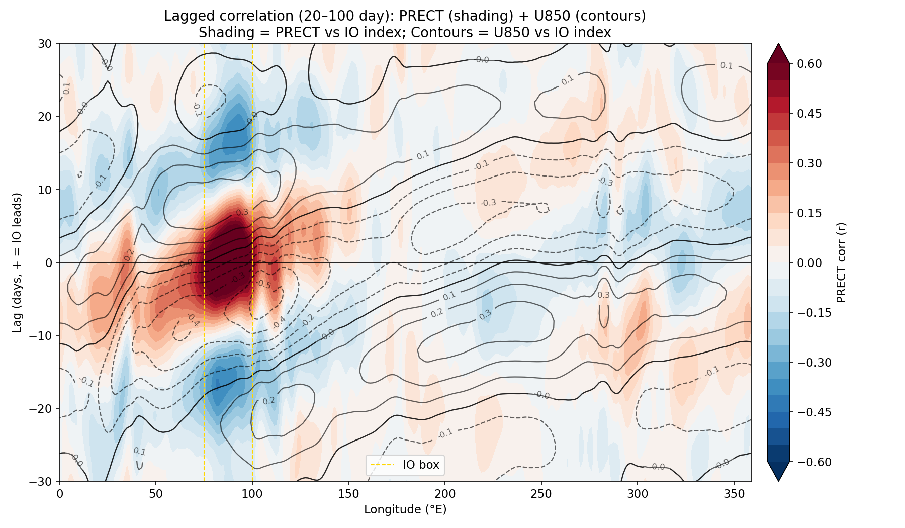
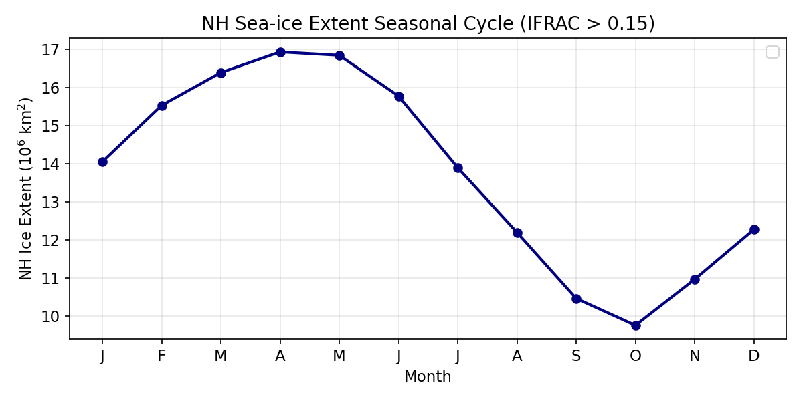
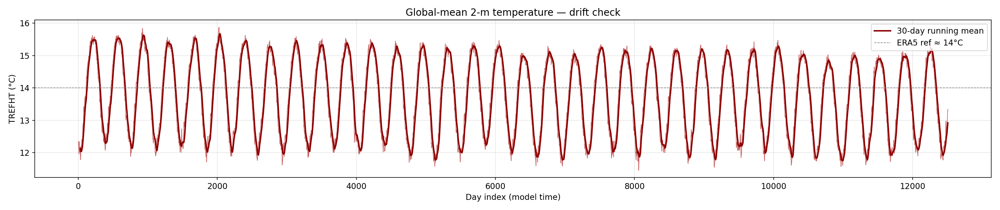

## The Scientific Gap {.smaller}

::: {.columns}
::: {.column width="55%"}
**We have been working significantly with uncoupled systems:**

| Mode | Atmosphere | Ocean |
|------|-----------|-------|
| AMIP | active | prescribed SST/ICE |
| OMIP / GIAF | prescribed ATM | active  |
| **This work** | **ML ATM** | **active** |

**The problem:**

- In OMIP, the ocean responds to forcing — but the forcing never changes based on what the ocean does
- Warm SST anomalies can't generate more evaporation, shift the jet stream, or modify precipitation
- **Interactive air-sea feedback is missing**
:::
::: {.column width="45%"}
**Why it matters:**

- The climate system is coupled 
    - ENSO is an air-sea coupled phenomenon 
    - MJO propagation depends on air-sea heat exchange
    - AMOC sensitivity to wind stress changes
    - Climate drift in long runs is partly an air-sea feedback problem

::: {.callout-note}
Standard GIAF runs have been the workhorse of ocean-only CESM science for 20(?) years. We're upgrading the atmosphere from "prescribed file reader" to "AI physics."
:::
:::
:::

---

## CAMulator in 30 Seconds {.smaller}

::: {.columns}
::: {.column width="55%"}
**Quick framing:**

- Autoregressive 6-hr emulator of CAM6
- 1° resolution, 130 prognostic channels
- Enforces conservation of dry air mass, moisture, total energy
- **350× speedup** over CAM6
- Captures ENSO, NAO, PNA, realistic variability

**The limitation this coupling addresses:**

CAMulator was trained and evaluated with **prescribed SST/IFRAC** — it responds to the ocean but the ocean never responds back. This is exactly the AMIP problem, now for ML models.

**This work:** replace the prescribed SST/ICE with a live POP2 ocean/CICE.
:::
::: {.column width="45%"}
```{mermaid}
%%| fig-width: 6
%%{init: {'theme': 'default'}}%%
graph TD
    A["CAM6<br/>(full physics)"] -->|"train on 30 yrs"| B["CAMulator<br/>(AI emulator)"]
    D["Prescribed SST<br/>(AMIP-style)"] -->|"training regime"| B
    B -->|"350× faster"| C["Large ensembles<br/>Centennial runs"]
    E["Live POP2 SST<br/>(this work)"] -.->|"new frontier"| B
```

**Today's:** Does a coupled CAMulator + POP2 system stay stable and physically meaningful? I will only show smoke tests.
:::
:::

---

## What I Built {.smaller}

::: {.columns}
::: {.column width="50%"}
**First(?) coupling of an ML atmosphere to a fortran/physics ocean + sea ice**

- CAMulator replaces DATM prescribed forcing entirely
- POP2 + CICE receive **evolving, CAMulator** air-sea fluxes
- Ocean SST feeds back into CAMulator every **6 hours**
- **No coupler modifications** — piggybacked on existing GIAF compset

**First results:**

- 10-day test: stable, no blow-up
- 3, 35 year runs completed
- **42 SYPD** on 2 Derecho CPU nodes + 1 Casper A100
:::
::: {.column width="49%"}
```{python}
#| echo: false
#| fig-width: 5.5
#| fig-height: 5.2
import matplotlib.pyplot as plt
from matplotlib.patches import FancyBboxPatch

fig, ax = plt.subplots(figsize=(6.5, 5.6))
ax.set_xlim(-2.2, 7.2)
ax.set_ylim(-0.2, 8.8)
ax.axis('off')
fig.patch.set_facecolor('white')

cam_face, cam_edge = '#DBEAFE', '#2563EB'
cpl_face, cpl_edge = '#F3F4F6', '#6B7280'
ocn_face, ocn_edge = '#D1FAE5', '#059669'

BX, BW, BH = 0.0, 5.0, 1.7

def draw_box(y, face, edge, title, sub, hw):
    ax.add_patch(FancyBboxPatch((BX, y), BW, BH,
        boxstyle="round,pad=0.12", facecolor=face, edgecolor=edge,
        linewidth=2.5, zorder=2))
    cx = BX + BW / 2
    ax.text(cx, y + BH*0.73, title, ha='center', va='center',
            fontsize=12, fontweight='bold', color='#111827', zorder=3)
    ax.text(cx, y + BH*0.43, sub, ha='center', va='center',
            fontsize=9.5, color=edge, zorder=3)
    ax.text(cx, y + BH*0.15, hw, ha='center', va='center',
            fontsize=8, color='#9CA3AF', style='italic', zorder=3)

Y_CAM, Y_CPL, Y_OCN = 6.6, 3.8, 1.0
draw_box(Y_CAM, cam_face, cam_edge, 'CAMulator',   'AI Atmosphere',  'Casper GPU')
draw_box(Y_CPL, cpl_face, cpl_edge, 'CPL7',        'Coupler',        'Derecho CPUs')
draw_box(Y_OCN, ocn_face, ocn_edge, 'POP2 + CICE', 'Ocean + Ice',    'Derecho CPUs')

# Gaps: CAM bottom = Y_CAM, CPL top = Y_CPL + BH
G1_BOT, G1_TOP = Y_CPL + BH, Y_CAM     # 5.5 to 6.6 → gap = 1.1
G2_BOT, G2_TOP = Y_OCN + BH, Y_CPL     # 2.7 to 3.8 → gap = 1.1

LX = BX + BW * 0.28   # left arrow x
RX = BX + BW * 0.72   # right arrow x

def vert_arrow(x, y_from, y_to, color):
    pad = 0.06
    ax.annotate('', xy=(x, y_to + pad), xytext=(x, y_from - pad),
        arrowprops=dict(arrowstyle='->', color=color, lw=2.0), zorder=4)

def left_label(y_mid, lines, color):
    for i, line in enumerate(lines):
        ax.text(LX - 0.25, y_mid + 0.22 - i*0.30, line,
                ha='right', va='center', fontsize=8, color=color,
                fontweight='bold', zorder=5)

def right_label(y_mid, lines, color):
    for i, line in enumerate(lines):
        ax.text(RX + 0.25, y_mid + 0.22 - i*0.30, line,
                ha='left', va='center', fontsize=8, color=color,
                fontweight='bold', zorder=5)

# Gap 1: CAM ↔ CPL
g1_mid = (G1_BOT + G1_TOP) / 2
vert_arrow(LX, G1_TOP, G1_BOT, cam_edge)   # down: CAM → CPL
left_label(g1_mid, ['winds, fluxes', 'cam_out.nc'], cam_edge)
vert_arrow(RX, G1_BOT, G1_TOP, ocn_edge)   # up:   CPL → CAM
right_label(g1_mid, ['SST, ifrac', 'sst_in.nc'], ocn_edge)

# Gap 2: CPL ↔ OCN
g2_mid = (G2_BOT + G2_TOP) / 2
vert_arrow(LX, G2_TOP, G2_BOT, cpl_edge)   # down: CPL → OCN
left_label(g2_mid, ['stress, SW/LW', 'rain, snow'], cpl_edge)
vert_arrow(RX, G2_BOT, G2_TOP, ocn_edge)   # up:   OCN → CPL
right_label(g2_mid, ['SST, ifrac'], ocn_edge)

plt.tight_layout(pad=0.1)
plt.show()
```
:::
:::

---

## How It Works: The DATM Mode {.smaller .scrollable}

::: {.columns .smaller}
::: {.column width="50%"}
**Idea: write a new DATM datamode**

Instead of reading CORE2/JRA55 forcing files, `DATM_MODE = CAMULATOR` calls our Python inference server via the filesystem:

```
Every 6 hours:
  DATM writes  → sst_in.nc  (SST from POP2)
  DATM writes  → go.flag
  [polls every 1s, timeout 1h]
  DATM reads   ← cam_out.nc (10 flux fields)
  DATM reads   ← done.flag
```

**Two files changed in CESM source:**

1. New: `datm_datamode_camulator.F90`
2. Wired into: `datm_comp_mod.F90` (`case('CAMULATOR')`)

**Activated by** `DATM_MODE = CAMULATOR` in `user_nl_datm`
:::
::: {.column width="50%"}
**Why file-based interface?**

- No Fortran↔Python interop (no FTORCH/FORPY, no sockets)
- 6-hr coupling interval → ~10 MB I/O overhead is negligible
- Fully debuggable: inspect every `sst_in.nc` and `cam_out.nc` independently
- Model-agnostic: swap `camulator_server.py` for any CREDIT model — Fortran side never changes

**Key physics handled server-side:**

- SST/IFRAC injected into **forcing tensor**
- FSNS → FSDS: albedo inversion so CPL7 doesn't double-count surface reflection
- FLNS → FLDS: isolates downwelling component
- Over-land SST fill for continental grid points
- Dynamic boundary layer height (`z_bot ∝ T_bot`)
:::
:::

---

## Flux Conversions: Net → Downwelling {.smaller}

CAMulator outputs net fluxes at the surface. CPL7 expects downwelling fluxes and applies surface albedo internally — so we have to invert before handing off.

::: {.columns .smaller}
::: {.column width="50%"}
**SW — albedo inversion**

$$\text{FSDS} = \frac{\text{FSNS}}{1 - \alpha_\text{sfc}}$$

$$\alpha_\text{sfc} = (1-f_\text{ice})\times 0.06 + f_\text{ice}\times 0.60$$

Passing FSNS directly would double-count the reflection — CPL7 applies albedo again internally. 

$f_\text{ice}$ is taken from CICE at the same timestep so the correction always tracks actual ice cover.
:::
::: {.column width="50%"}
**LW — Stefan-Boltzmann reconstruction**

$$\text{FLNSD} = 0.99\,\sigma T_S^4 + \frac{\text{FLNS}}{\Delta t}$$

CAMulator gives net upward LW (FLNS). Adding back the upward surface emission ($0.99\,\sigma T_S^4$) isolates the downwelling component that CPL7 needs to force the ocean.
:::
:::

---

## Dynamic $z_\text{bot}$ and Monin-Obukhov Theory (?) {.smaller}

::: {.columns }
::: {.column width="55%" style="font-size: 0.72em"}
CPL7's COARE-style bulk scheme needs the **reference height** $z_\text{bot}$: the height of the data read in to compute the M-O stability correction and from that the wind stress $\tau$, sensible heat $H$, and latent heat $LE$.

In CAM6 it's not a fixed number; it varies ~50–67 m with surface temperature. We derive it consistently from the hybrid coordinate and the hypsometric equation:

                                                                                                                                                                                                                                                                         
  $$p_\text{mid} = \underbrace{a_{N-1} p_0}_{\approx\, 0} + \frac{b_{N-1}+1}{2}\, p_s \;\approx\; \frac{b_{N-1}+1}{2}\, p_s$$
                                                                                                                                                                                                                                                                                                               
  $$z_\text{bot} = \frac{R_d}{g}\ln\!\frac{p_s}{p_\text{mid}} \cdot T_\text{bot} \approx \frac{R_d}{g}\left(-\ln\frac{b_{N-1}+1}{2}\right) T_\text{bot} \approx 0.219\, T_\text{bot}$$


```python
Z_BOT_SCALE = (287.058/9.80616) \
    * (-np.log(0.5*(hybi[-2]+1)))  # 0.2187 m/K
z_bot = Z_BOT_SCALE * T_bot        # 50–67 m
```
:::
::: {.column width="45%"}
**Getting $z_\text{bot}$ wrong changes which stability regime CPL7 thinks it's in.**

- In stable conditions (cold SST under warm air), a wrong $z_\text{bot}$ artificially suppresses wind stress
- In unstable conditions (warm tropical SST), it sets the strength of the convective enhancement of $H$ and $LE$

These aren't small corrections and **this is the thing I'm most neverous about**

For example: the Southern Ocean, Arctic margins, the MJO warm pool, and eastern boundary upwelling zones all spend significant time in strongly stratified regimes.
:::
:::

---

## Speed: How does 42 SYPD Compare? {.smaller}

::: {.columns}
::: {.column width="55%" style="font-size: 0.92em"}


| Configuration | Speed (SYPD) | Hardware |
|--------------|:------------:|---------|
| Full CESM2 (CAM6 + POP2) | ~7.3 | 8 Derecho nodes |
| GIAF (DATM + POP2, no AI) | 37.935 | 2 Derecho nodes |
| **CAMulator + POP2 (this work)** | **42.025** | 2 CPU + 1 A100 |

::: {.callout-note}
we get a **prognostic, interactive atmosphere** at roughly the same wall-clock cost as prescribed forcing and 6X cheaper than running full CAM6 + POP2.
:::
:::
::: {.column width="45%"}
**Per-step breakdown on A100 (ms):**

| Stage | Time |
|-------|:----:|
| Build input tensor | ~5 |
| CAMulator inference (JIT) | ~190 |
| Inverse transform | ~8 |
| Grid remap (T62 ↔ 1°) | ~3 |
| Write cam_out.nc | ~15 |
| **Total server time** | **~220** |

**CAM6 reference:** one 6-hr step ~4932 ms on 8 CPU Nodes

CESM's ocean/ice compute is the wall-clock bottleneck — not inference.
:::
:::

---

## Movie: Monthly SSTs and Precip

<video style="display:block; margin:auto; max-height:540px; width:auto;" autoplay loop muted controls>
  <source src="movie1.mp4" type="video/mp4">
</video>

## Movie: ENSO

<video style="display:block; margin:auto; max-height:540px; width:auto;" autoplay loop muted controls>
  <source src="enso_rotating_earth.mp4" type="video/mp4">
</video>


---

## ENSO: Niño 3.4 Index {.smaller}

The coupled run produces realistic interannual SST variability in the tropical Pacific — ENSO cycles emerge spontaneously from the coupled system.

{width="100%"}

---

## ENSO: Spatial Pattern {.smaller}

SST regression on Niño 3.4 shows the correct east-Pacific warming structure and horseshoe cooling in the off-equatorial Pacific.

{width="72%" fig-align="center"}

---

## ENSO: Power Spectrum {.smaller}

Spectral power peaks within the 2–7 year ENSO band, consistent with observed ENSO periodicity.

{width="90%" fig-align="center"}

---

## MJO: Lagged Correlation {.smaller}

The coupled run captures eastward-propagating convective anomalies on intraseasonal timescales — precipitation and 850 hPa wind both track the Indian Ocean signal with the correct-ish phase relationship.

{width="78%" fig-align="center"}

---

## Results: Northern Hemisphere Sea Ice {.smaller}

NH sea ice extent follows a realistic seasonal cycle with no runaway loss or gain over the 35-year run.

{width="92%" fig-align="center"}

---

## Results: Global Mean Temperature {.smaller}

Global-mean 2m air temperature shows no long-term drift over the 35-year run — the coupled system is stable (ish).

{width="92%" fig-align="center"}

---

## What 42 SYPD Enables {.smaller}

::: {.columns}
::: {.column width="50%"}
**With a large speedup over CAM6, coupled experiments become feasible that weren't before:**

- **Large ensembles** with interactive ocean — 50–100 member ENSO forecasts at seasonal range
- **Centennial runs** to study climate drift, AMOC stability, heat uptake
- **Parameter sensitivity sweeps** — vary ocean mixing, ice albedo, test parameterization choices at low cost
- **Rapid prototyping** of new coupling strategies before investing in full CESM runs
:::
::: {.column width="50%"}
**The flag-file interface is intentionally model-agnostic:**

```bash
# Swap in any CREDIT model:
camulator_server.py        # CAMulator
→ fuxi_server.py           # FuXi
→ pangu_server.py          # Pangu-Weather
→ ACE2_server.py           # Ai2
```

The Fortran side (`datm_datamode_camulator.F90`) never changes. Any model that can read `sst_in.nc` and write `cam_out.nc` can be plugged in.

<!-- ::: {.callout-note}
**Planned open release:** CESM patch + server script → community tool for coupling any AI atmosphere to CESM Ocean/CICE.
::: -->
:::
:::

---

## Next Steps {.smaller}

::: {.columns .smallest}
::: {.column width="50%"}
**Science questions now open:**

1. **ENSO response** — does CAMulator + POP2 produce realistic ENSO amplitude and period? Does it improve over OMIP?
    - **Creating an ACE2 Sever is Trivial in CREDIT** - what ocean biases emerge with a reanalysis atmosphere? 
2. **MJO air-sea feedback** — does the interactive atmosphere change MJO propagation speed or coherence?
    - **Creating an ACE2 Sever is Trivial in CREDIT** - what ocean biases emerge with a reanalysis atmosphere?  
3. **AMOC stability** — multi-decadal runs with changing wind stress
4. **SST bias evolution** — does CAMulator's known high-latitude cold bias change ocean heat uptake?
5. **Ensemble spread** — do coupled members diverge faster than AMIP/OMIP members? S2S simulations
6. Ocean stuff, I know next to nothing about the ocean.
7. Does calibrating ocean with this atmosphere help the bottleneck? 
:::
::: {.column width="50%"}
**Technical next steps:**

- **Phase 2:** bypass CPL7 bulk formula — pass `Faxa_taux/tauy` directly instead of `Sa_u/Sa_v` and Latent / Sensible Heat
- **Retrain** CAMulator to directly simulated downward fluxes at surface 
- **MOM6** coupling (CESM3 ocean)
    - Just switch the compset and this should(?) work now. 

**Community:**

- CESM patch + `camulator_server.py` → open release
- Generalise server interface for any CREDIT model
- Share restart-safe launch scripts with the community
:::
:::

---

## Summary {.smaller}

::: {.columns}
::: {.column width="60%"}
**We coupled an AI atmosphere to a dynamic ocean by:**

1. **Writing a new DATM datamode** (`CAMULATOR`) — zero coupler modifications, file-based flag I/O, fully debuggable

2. **Tried to get the physics right**: FSNS→FSDS albedo inversion so CPL7 doesn't double-count surface reflection; dynamic $z_\text{bot}$ derived from hybrid coordinates for physically consistent M-O stability corrections

3. **Running it:** 42 SYPD, 35-year run stable, POP2 + CICE receiving evolving AI-generated fluxes and feeding SST back at every step

*(Also had to fix a deep CPL7 pointer bug where `xao_ax` was never assigned for DATA ATM — see Appendix)*

**42 SYPD + prognostic ocean = multi-century coupled experiments at a fraction of the cost of full CESM**
:::
::: {.column width="40%"}
**Code / contact:**

```bash
# Implementation
/glade/work/wchapman/Roman_Coupling/
  credit_feb182026/climate/
    camulator_server.py
    datm_datamode_camulator.F90
    launch_coupled_run.sh

# Active case
/glade/work/wchapman/cesm/CREDIT/
  g.e21.CAMULATOR_GIAF_v02/
```


:::
:::

---

# Appendix {background-color="#2F2F2F"}

*Slides below contain implementation detail for follow-up discussion*

---

## A: Component Glossary {.smaller .scrollable}

| Component | Role in this project |
|-----------|---------------------|
| **CESM2/CPL7** | Framework + MCT-based Fortran coupler; remaps fields between grids, applies bulk formulae |
| **DATM** (Data ATM) | Normally reads CORE2/JRA55 prescribed forcing. **Here: runs CAMULATOR mode** — a new datamode we wrote |
| **CAMulator** | Autoregressive 6-hr AI atmosphere trained on CAM6 output. 192×288 (1°), 130 prognostic channels |
| **POP2** | 3D ocean on gx1v7 displaced-pole grid (~1°, 320×384). Evolves SST, salinity, currents |
| **CICE** | Sea ice on same gx1v7 grid. Exchanges heat, momentum, freshwater with POP + atmosphere |
| **T62 grid** | DATM's native Gaussian grid: 94 lat × 192 lon. All DATM→CPL fields live here |
| **GIAF compset** | DATM%IAF + POP2 + CICE — the baseline we piggyback on |

---

## B: Full Architecture {.smaller .scrollable}

```
┌─────────────────────────────────────────────────────────────────────────┐
│   CESM2 CPL7 coupled run   (Fortran/MPI, CPU ranks on Derecho)          │
│                                                                          │
│   POP2 ──SST──► CPL7 ──x2a_So_t──► DATM (CAMULATOR mode)               │
│                                          │                               │
│                              write camulator_sst_in.nc                   │
│                              write camulator_go.flag   ───► [GPU server] │
│                                          ↑                               │
│                              read  camulator_done.flag ◄─── [GPU server] │
│                              read  camulator_cam_out.nc                  │
│                                          │                               │
│   POP2 ◄──a2x fluxes──── CPL7 ◄──────────┘                              │
└─────────────────────────────────────────────────────────────────────────┘
                   ▲ shared GLADE filesystem
┌──────────────────┴──────────────────────────────────────────────────────┐
│   camulator_server.py  (Python, A100 GPU, pre-launched on Casper)        │
│                                                                          │
│   loop:  watch go.flag → read sst_in.nc → inject SST → run CAMulator    │
│          → write cam_out.nc → write done.flag                            │
└─────────────────────────────────────────────────────────────────────────┘
```

---

## C: Grid Remapping {.smaller}

::: {.columns}
::: {.column width="48%"}
| Grid | Dims | Used by |
|------|------|---------|
| T62 Gaussian | 94 × 192 | DATM, CPL7 |
| CAMulator 1° | 192 × 288 | AI model |

Precomputed `BilinearRemap` weights at startup → remap ~2.5 ms (vs ~500 ms with `RegularGridInterpolator` every step)

**T62 Gaussian latitudes** computed exactly:
```python
from scipy.special import roots_legendre
mu, _ = roots_legendre(94)
t62_lat = np.degrees(np.arcsin(mu[::-1]))
```
:::
::: {.column width="52%"}
```python
class BilinearRemap:
    """Precomputed bilinear weights for T62 ↔ CAMulator."""
    def __init__(self, src_lat, src_lon,
                       dst_lat, dst_lon):
        # compute weight matrices once at startup
        ...

    def batch(self, fields_dict: dict) -> dict:
        """Remap all fields in one vectorised call."""
        out = {}
        for name, arr in fields_dict.items():
            out[name] = (self.weights @ arr.ravel()
                         ).reshape(self.dst_shape)
        return out
```
:::
:::

---

## D: SST Injection Detail {.smaller .scrollable}

```python
# 1. Read SST from sst_in.nc [K]
sst_t62 = ds['sst'].values           # 94×192

# 2. Remap T62 → CAMulator 1° grid
sst_cam = remap_t62_to_cam(sst_t62)  # 192×288

# 3. Over-land fill (POP only provides ocean points)
mask = sst_cam > 270.0               # True = ocean
sst_blended = np.where(mask, sst_from_pop, 283.0)

# 4. Normalize and inject into forcing tensor
sst_norm = (sst_blended - sst_mean) / sst_std
model_input = stepper.state_manager \
    .build_input_with_forcing(state, forcing_t, static)
accessor_input.set_state_var(model_input, 'SST', sst_norm_tensor)

# 5. Run inference
prediction = stepper.model(model_input.float())
```

**SST is a `dynamic_forcing_variable`** (not prognostic state) — it lives in the forcing tensor, not in the 130-channel prognostic state. This is why injection works without retraining the model.

---

## E: Flux Conventions {.smaller}

::: {.columns}
::: {.column width="52%"}
| Variable | CAMulator units | → cam_out.nc |
|----------|----------------|--------------|
| `FSNS` | J m⁻² (6h total) | ÷ 21600 → W m⁻² |
| `FLNS` | J m⁻² upward | ÷ (−21600) → W m⁻² ↓ |
| `PRECT` | m s⁻¹ liq-eq | direct |
| `TAUX/TAUY` | Pa | direct |

**SW albedo inversion:**
$$\text{FSDS} = \frac{\text{FSNS}}{1 - \alpha_\text{sfc}}$$
$$\alpha_\text{sfc} = (1-f_\text{ice}) \times 0.06 + f_\text{ice} \times 0.60$$

CPL7 treats `Faxa_sw*` as downwelling and applies albedo internally — passing FSNS directly double-counts it.
:::
::: {.column width="48%"}
**LW reconstruction:**
$$\text{FLNSD} = 0.99\,\sigma\,T_S^4 + \frac{\text{FLNS}}{\Delta t}$$

**Dynamic boundary layer height:**
```python
Z_BOT_SCALE = (287.058/9.80616) \
    * (-np.log(0.5*(hybi[-2]+1)))  # = 0.2187 m/K

z_bot = Z_BOT_SCALE * T_bot  # 50–67 m range
```
:::
:::

---

## F: Restart Handling {.smaller}

::: {.columns}
::: {.column width="53%"}
**ATM restart file** (`camulator_atm_restart.pth`):

```python
{
    'state':     state_tensor,   # 130-ch CPU tensor
    'timestep':  int,
    'last_ymd':  int,
    'last_tod':  int,
    'cam_out':   cam_out_dict,   # re-send on CONTINUE_RUN
}
```

On `CONTINUE_RUN=TRUE`, CESM re-sends the last `go.flag`. Server detects `current_ymd == last_ymd`, re-sends saved `cam_out` without re-inference.
:::
::: {.column width="47%"}
**Year-boundary repeated dates:**

CESM sends the year-boundary date **three times** during restart init. Fix: date-based forcing index (same date → same forcing slice, always).

**Annual archive:**
```bash
rundir/atm_archive/
  YYYY/
    camulator_atm_YYYY-001.nc
    camulator_atm_YYYY-002.nc  (daily)
    camulator_atm_restart.pth
```
:::
:::

---

## G: Launch Workflow {.smaller}

```{mermaid}
sequenceDiagram
    participant U as User (login node)
    participant S as camulator_server.py (Casper A100)
    participant C as CESM (Derecho CPU nodes)
    participant G as GLADE filesystem

    U->>S: qsub server job (Casper)
    S->>S: load model, JIT trace (~60s)
    S->>G: write camulator_server_ready.flag

    U->>U: launch_coupled_run.sh polling...
    U->>C: case.submit (triggered by ready flag)

    loop Every 6 hours
        C->>G: write sst_in.nc + go.flag
        G->>S: server detects go.flag
        S->>S: inject SST, run inference (~200ms)
        S->>G: write cam_out.nc + done.flag
        G->>C: DATM reads cam_out.nc
        C->>C: CPL7 remaps, applies bulk formula
        C->>C: POP2 + CICE advance one step
    end

    C->>G: write restart files (annual)
    S->>G: write camulator_atm_restart.pth
```

---

## H: The CPL7 Bug {.smaller .scrollable}

::: {.columns}
::: {.column width="55%"}
**Symptom:** Ocean sees SST = 0 K on every coupling step despite POP sending valid temperatures.

**Root cause** — `cime_comp_mod.F90`:

The `xao_ax` pointer (ATM↔OCN flux object) is initialised only inside:
```fortran
if (atm_prognostic) then
   ! ... init phase ...
   xao_ax => prep_aoflux_get_xao_ax()   ! line ~1974
end if
```

For DATA ATM (`atm_prognostic = .false.`), this block is **never entered** → `xao_ax` stays `null()`.

Later at every coupling step:
```fortran
if (associated(xao_ax)) then   ! .false. !
   call prep_atm_mrg(...)      ! NEVER RUNS
end if
! → x2c_cx stays zero → SST = 0
```

**No one had ever run a DATA ATM that needed to read back ocean state — this code path had never been exercised in 20 years of CESM.**
:::
::: {.column width="45%"}
**Three-part fix (all in ATM SETUP-SEND block):**

**Fix 1 & 2** — widen two guards from `atm_prognostic` to `(atm_prognostic .or. atm_present)`:
```fortran
if (atm_prognostic .or. atm_present) then
   ! prep-merge block
end if

if (atm_prognostic .or. atm_present) then
   call component_exch(atm, flow='x2c')
end if
```

**Fix 3** — assign pointer before the `associated()` check:
```fortran
! ROOT CAUSE FIX
xao_ax => prep_aoflux_get_xao_ax()
if (associated(xao_ax)) then
   call prep_atm_mrg(...)  ! now runs!
end if
```

**Confirmed:** 10-day coupled run at **42 SYPD** ✅
:::
:::
